# Design Document
As a clinician, I should be able to use this calculator for two purposes:
1) Verifying the dosing for incoming prescriptions (hospital orders or community prescriptions)
2) Writing my own prescriptions for antibiotics after an APA assessment

# Project Progress Map

```mermaid
graph LR
A[UI/UX]-->AA
B[Clinical]-->BA
C[Patient Material]-->CA

%% STYLES
classDef done fill:#00224D
classDef prog fill:#5D0E41
classDef lock fill:#FF204E

%% CLASSES
class AZ done;
class A,B,C prog;
class AA,BA,CA lock;
```

# How It Should Look

For purpose (1), I need input fields for the new RX (mg or ml, to accommodate however the prescriber wrote it)
I would then like to see the reference dosing from bugs

For reference, I have anonymized several pediatric prescriptions for antibiotics. These are how antibiotic prescriptions appear in these order samples:

### Sample 1
Azithromycin 200mg/5mL  
SIG: 1 DOSE PO Daily x 5 Days  
M: 5 DOSE  
Notes: 10 mg/kg x 1 day, 5mg/day x 1 day as per wt of 18.5lbs  
> [!Note]
> Indication = Pertussis (+ve swab)

### Sample 2
Amoxicillin 50mg/mL liquid oral  
SIG: Take 9 mL (450mg total) by mouth three (3) times per day for 5 days.  
M: 135 mL  
> [!Note]
> wt = 27kg
> Indication = Otitis Media

### Sample 3
Amoxicillin-clavulanic acid (7:1) 40 - 5.7 mg/mL Oral Liquid  
SIG: Take 12.5 mL (500mg of amoxicillin total) by mouth every eight (8) hours for 10 days.  
M: 375 mL  
> [!Note]
> wt = 70lbs
> Indication = Otitis Media

### Sample 4
Amoxicillin suspension 250mg/5ml (oral)  
SIG: 4 ml TID x 7 days
M: 84 mL
> [!Note]
> wt missing
> indication missing

### Sample 5
Dexamethasone 0.5 mg (oral 0.5 mg tablet)  
SIG: 10mg once  
M: 10mg  

Azithromycin 100mg/5ml (oral 100mg/5ml suspension for reconstitution)  
SIG: 8.5 mL once, then 4.2 mL daily for 4 days. Total of 5 days  
M: 17 ml  
> [!Note]
> wt = 16.9kg
> age = 4yo
> Indication missing

### Sample 6
Azithromycin 200mg/5ml suspension  
SIG: 120mg daily x 5 days  
M: 600mg
> [!Note]
> wt = 12kg
> age = 22mo
> "10mg/kg/day 3ml"
> Indication = "chest infection"

### Sample 7
Azithromycin 40mg/mL liquid oral  
SIG: Take 2 ml (80mg total) by mouth daily x 5 days  
M: 10ml  
> [!Note]
> wt = 15kg
> Indication = "chest infection"

### Sample 8
Clavulin 125mg/5ml susp  
SIG: 3ml TID x 7 days  
M: 63ml  
> [!Note]
> wt = 4.5kg
> age = <1yo
> Indication = Otitis Media

### Sample 9
Amoxicillin-clavulanic acid (7:1) 40 - 5.7mg/ml oral liquid  
SIG: Take 5ml (200mg of amoxicillin total) by mouth every eight hours x 10 days  
M: 150ml
> [!Note]
> Indication = Otitis media
> wt missing

### Sample 10
Amoxicillin 50mg/ml liquid oral  
SIG: Take 4.5ml (225mg total) po TID x 7 days  
M: 94.5ml
> [!Note]
> wt = 18.8lbs
> Indication = double otitis media

### Sample 11
Azithromycin 40mg/ml liquid oral  
SIG: 3ml (120mg total) po daily x 1 day, then 1.5ml (60mg total) daily x 4 days  
M: 9ml  
> [!Note]
> wt = 25lbs
> Indication = "cough/chest"
