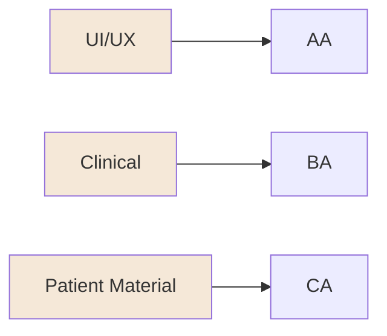

# pediatric-antibiotic-calculator
Pediatric antibiotic calculator based on Albertan guidelines found at bugsanddrugs.org

# Project Progress Map

```mermaid
graph LR
A[UI/UX]-->AA
B[Clinical]-->BA
C[Patient Material]-->CA

%% STYLES
classDef done fill:#1C1C1C
classDef prog fill:#F5E8D8
classDef lock fill:#FF6F61

%% CLASSES
class AZ done;
class A,B,C prog;
class AZ lock;
```
